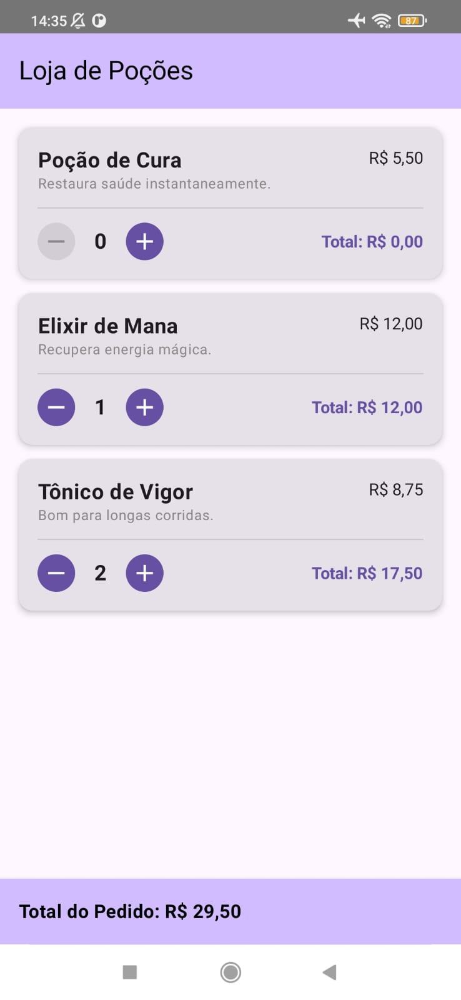

# The Alchemist's Shelf (A Prateleira do Alquimista)

**The Alchemist's Shelf** is a native Android application built with **Kotlin** and **Jetpack Compose**. It simulates an RPG item shop, allowing users to browse potions, manage a shopping cart, and view real-time price calculations.

This project was created to study and implement modern Android development best practices, specifically focusing on the transition from imperative UI (XML) to declarative UI (Compose).

## Screenshots

| English Version 🇺🇸 | Portuguese Version 🇧🇷 |
|:---:|:---:|
| | |
|  |  |

## Features

- **Product Listing:** Display items using `LazyColumn` for efficient rendering.
- **Shopping Cart System:**
  - Add and remove items dynamically.
  - Real-time calculation of item subtotals and the grand total.
- **Internationalization (i18n):**
  - Full support for **English (en)** and **Portuguese (pt-BR)**.
  - Strings, currency formatting, and pluralization rules handle locale changes automatically.
- **Custom Theming:**
  - Implementation of **Material Design 3**.
  - Custom color palette defined in `Color.kt` and `Theme.kt`.

## Tech Stack

- **Language:** Kotlin
- **UI Framework:** Jetpack Compose (Material 3)
- **Architecture:** Unidirectional Data Flow (UDF) & State Hoisting
- **IDE:** Android Studio

## Key Concepts Applied

This project demonstrates the following Jetpack Compose concepts:

1.  **State Hoisting:** Moving state (`cartState`) up to the `Screen` level so that child components (`PotionCard`) remain stateless and reusable.
2.  **Resources Management:** Using `@StringRes` and `stringResource` to handle translations dynamically instead of hardcoding strings.
3.  **MutableStateMap:** Using `mutableStateMapOf` to manage the cart items efficiently, triggering UI recomposition only when necessary.
4.  **Compose Layouts:** Extensive use of `Scaffold`, `LazyColumn`, `Row`, `Column`, and `Card`.

## How to Run

1.  Clone this repository.
2.  Open the project in **Android Studio**.
3.  Sync Gradle files.
4.  Run on an Emulator or Physical Device (API 24+ recommended).
